# Website Requirements Specification: Dr. Reena Agrawal

**Project Overview:** A modern, multi-vertical personal brand and professional consultancy platform. The domain features a central landing page that acts as an umbrella portal, routing visitors to three distinct, specialized sub-domains/sub-pages. Each sub-page retains the primary domain identity while boasting its own visual theme, firm branding, accreditations, and service offerings.

---

## 1. Information Architecture & User Flow

```mermaid
flowchart TD
    User([Visitor Arrives]) --> Home[Landing Page / Domain Root]

    Home --> Nav[Global Header / Nav]
    Home --> Hero[Hero / Identity Hub]
    Home --> ServiceCards[Three Pillars of Transformation]
    Home --> GlobalCreds[Overall Accreditations & Awards]
    Home --> GlobalContact[Central Inquiry & Booking Hub]
    Home --> Footer[Global Footer]

    ServiceCards -->|Click Service 1| PageYoga["/yoga-expert<br/>(Brand: Art of Learning Institute)"]
    ServiceCards -->|Click Service 2| PageEnergy["/energy-spatial-consultant<br/>(Brand: Divine Power)"]
    ServiceCards -->|Click Service 3| PageLead["/leadership-mindset-coach<br/>(Leadership & Corporate Hub)"]

    %% Page 1 Details
    PageYoga --> Y1[Accreditations: Skill India, IYA, Patanjali Parisad]
    PageYoga --> Y2[Programs: Classes, Courses, Therapy, Events]
    PageYoga --> Y3[Academic CV: PhD, MA, Specialized Diplomas]
    PageYoga --> Y4[Credentials: 15+ Yrs Exp, 500+ Teachers Trained]
    PageYoga --> Y5[Event Photo Gallery]

    %% Page 2 Details
    PageEnergy --> E1[Firm: Divine Power]
    PageEnergy --> E2[Vastu Science Suite]
    PageEnergy --> E3[Crystal & Gemstone Therapy]
    PageEnergy --> E4[Predictive Arts: Tarot, Numerology, Astrology]
    PageEnergy --> E5[Consultation Booking Engine]

    %% Page 3 Details
    PageLead --> L1[Corporate Training Programs]
    PageLead --> L2[Student Induction & Youth Orientation]
    PageLead --> L3[Keynote & Motivational Speaking]
    PageLead --> L4[Personal & Behavioral Counseling]
    PageLead --> L5[Corporate & Campus Event Gallery]
```

---

## 2. Global Site Structure & Design System

### Technical & UX Rules for Developer
* **Domain Structure:** Single domain with sub-paths (`/`, `/yoga-expert`, `/energy-spatial-consultant`, `/leadership-mindset-coach`).
* **Distinct Theming Mandate:**
  * **Main Landing Page:** Sophisticated, minimalist neutral palette (Ivory / Charcoal / Warm Gold) communicating authority across all three verticals.
  * **Page 1 (Yoga Expert):** Earthy, serene, holistic theme (Sage Green, Sand, Teal accents) aligned with the *Art of Learning Institute* logo aesthetic.
  * **Page 2 (Energy & Spatial Consultant):** Celestial, mystical yet modern theme (Deep Indigo, Amethyst, Champagne Gold) fitting *Divine Power*.
  * **Page 3 (Leadership & Mindset Coach):** Dynamic, corporate, confident theme (Navy Blue, Slate Grey, Crisp White, Amber highlights).
* **Global Components:** Consistent navigation bar (with dropdown to jump directly to any of the three verticals) and unified footer with centralized contact points.

---

## 3. Page-by-Page Functional & Content Specifications

### Page 0: Landing Page (Root `/`)

#### Section A: Hero Banner
* **Primary Headline:** Dr. Reena Agrawal
* **Sub-headline / Tagline:** Integrating Body, Space, and Mind — Holistic Wellness, Metaphysical Alignment & Leadership Development.
* **Lead CTAs:**
  * `Explore Verticals` (Scrolls to Services Grid)
  * `Book a Consultation` (Anchor link to central contact form)

#### Section B: Three Core Service Portals (Cards / Split-Screen Grid)
1. **Yoga Expert & Holistic Health**
   * *Tagline:* Classical yogic sciences, certified teacher training, and therapeutic healing.
   * *Brand:* Art of Learning Institute.
   * *CTA Button:* `Explore Yoga Institute →` (routes to `/yoga-expert`)
2. **Energy & Spatial Consultant**
   * *Tagline:* Harmonizing living environments, cosmic patterns, and personal energy fields.
   * *Brand:* Divine Power.
   * *CTA Button:* `Explore Divine Power →` (routes to `/energy-spatial-consultant`)
3. **Leadership & Mindset Coach**
   * *Tagline:* Corporate behavioral training, student orientations, and motivational mentorship.
   * *CTA Button:* `Explore Leadership Programs →` (routes to `/leadership-mindset-coach`)

#### Section C: Honors & Corporate Background
* **Highlight Bar:**
  * Conferred with the prestigious **Yoga Guru** Title
  * Recipient of **Yoga Ratna** & **Yoga Bhushan Samman** (February 2019)
  * Founder & Director: **Victorious Media** (Marketing & PR enterprise with 15+ professionals)
  * Over **15+ Years** of cross-disciplinary expertise

#### Section D: Central Contact & Booking Hub
* Interactive inquiry form with a dropdown to select the area of interest (Yoga Training, Vastu/Astro Consultation, or Corporate/Student Workshop).
* Direct WhatsApp chat button, official email, and social profiles (LinkedIn, YouTube, Instagram).

---

### Page 1: Yoga Expert (`/yoga-expert`)
*Sub-brand: Art of Learning Institute*  
*Theme: Serene Organic / Sage Green & Soft Teal*

#### 1. Header & Institute Banner
* **Institute Name:** Art of Learning Institute
* **Sub-title:** Yoga Teachers Training Institute, Yoga Therapy & Naturopathy Training Centre
* **Motto:** *॥ योगः कर्मसु कौशलम् ॥* (Excellence in Action is Yoga)
* **Official Accreditations & Badges:**
  * Accredited with **Skill India (Central Government)**
  * Affiliated / Associated with **Indian Yoga Association (IYA)**
  * Recognized by **Maharshi Patanjali Yog Evm Prakritik Chikitsa Sansthan & Research Centre**

#### 2. Key Achievements & Experience Metrics
* **15+ Years** of professional teaching and therapeutic practice.
* **500+ Certified Yoga Teachers & Instructors** trained through structured certificate programs.
* Honored with the **Yoga Guru** title; awarded **Yoga Ratna** and **Yoga Bhushan Samman** (Feb 2019).

#### 3. Core Offerings & Services
* **Regular Classes:** Daily/weekly batches for general fitness, flexibility, and daily mindfulness.
* **Yoga Courses & Teacher Trainings:** Certified instructor programs for aspiring trainers (Skill India aligned).
* **Yoga Therapy:** Prescriptive, individualized therapeutic yoga for chronic health issues, spinal alignment, stress, and lifestyle disorders.
* **Yoga Events & Retreats:** Mass yoga camps, International Yoga Day celebrations, and immersive retreats.

#### 4. Academic Profile & Qualifications
* **PhD (Doctorate) in Yogic Science** — *[University Name]* (completed post-MA)
* **MA in Yoga** — *[University Name]*
* **M.Sc. in Chemistry**
* **MA in Hindi**
* **Specialized Diplomas:**
  * Diploma in Yoga Therapy
  * Diploma in Kids Yoga
  * Diploma in Corporate Yoga
  * Diploma in Meditation & Pranayama

#### 5. Media Gallery
* Responsive grid showcasing past workshop events, teacher graduation ceremonies, and classroom sessions.

---

### Page 2: Energy & Spatial Consultant (`/energy-spatial-consultant`)
*Sub-brand: Divine Power*  
*Theme: Cosmic Mysticism & Spatial Elegance / Deep Indigo & Warm Gold*

#### 1. Banner & Brand Identity
* **Firm Name:** Divine Power
* **Consultant:** Dr. Reena Agrawal
* **Positioning:** Comprehensive environmental harmonization, vibrational therapy, and predictive life guidance.

#### 2. Service Disciplines

##### A. Vastu Shastra Consultancy
* **Space and Energy Balance:** Environmental audits to eliminate negative geopathic and energetic stress.
* **Remedial Vastu:** Non-demolition solutions using energy corrections, elemental rebalancing, and spatial adjustments.
* **Astro Vastu:** Synchronizing personal astrological horoscopes with architectural directional layouts.
* **Numero Vastu:** Harmonizing house/flat numbers and measurements with personal life path numbers.
* **Residential & Commercial Vastu:** Layout blueprints and optimization for homes, corporate offices, factories, and retail spaces.
* **Land & Flat Selection:** Pre-purchase site evaluation, soil inspection, and directional viability assessments.

##### B. Crystal Therapy & Energy Balancing
* **Crystal Healing:** Targeted chakra balancing, aura clearing, and therapeutic frequency work using selected crystals.
* **Crystal & Gemstone Consultation:** Personalized recommendations of certified stones and gems to enhance health, abundance, and mental peace.

##### C. Predictive & Advisory Sciences
* **Numerology:**
  * Name correction and vibration alignment for individuals and corporate business brands.
  * Complete numerological life-chart analysis.
* **Tarot Advisory:** Intuitive archetypal card readings for clarity on career choices, relationships, and immediate life transitions.
* **Vedic Astrology:** Comprehensive planetary chart mapping, dasha analysis, timing of opportunities, and personalized remedial measures.

#### 3. Booking Engine
* Direct appointment scheduling module with file-upload option (for uploading floor plans, floor maps, and birth details prior to the session).

---

### Page 3: Leadership & Mindset Coach (`/leadership-mindset-coach`)
*Theme: Corporate Excellence & Transformational Leadership / Navy Blue & Slate Silver*

#### 1. Profile & Approach
* High-impact training, keynote speaking, and counseling sessions focused on cognitive clarity, emotional intelligence, and peak performance.
* Supported by Dr. Agrawal’s entrepreneurial background as the leader of **Victorious Media** (15-member team).

#### 2. Core Service Verticals
* **Corporate Training:**
  * Stress management, workplace wellness, and burnout prevention.
  * Executive presence, empathetic leadership, and mindful communication.
  * Team alignment and synergy workshops.
* **Student Induction & Youth Orientation:**
  * Campus-to-corporate transitional workshops.
  * Exam anxiety alleviation, cognitive focus drills, and goal-setting seminars.
* **Motivational Speaking:**
  * Keynote addresses for corporate annual meetings, industry conferences, and academic convocations.
  * Inspiring narratives on resilience, mind management, and balanced living.
* **Personal & Behavioral Counseling:**
  * Confidential 1-on-1 counseling for stress, career crossroads, emotional blockages, and self-limiting beliefs.

#### 3. Event Showcase & Corporate Endorsements
* Photo gallery of auditorium presentations, boardroom workshops, and campus orientation events.
* Testimonial carousel for HR managers, institution directors, and individual clients.

---

## 4. Technical Deliverables for the Development Team

1. **Responsive Design:** 100% mobile-friendly layout across all views, ensuring high image quality for certificates and event photography.
2. **Lead Routing:** Form submissions on each sub-page should tag the specific lead category (e.g., `Category: Yoga`, `Category: Vastu`, `Category: Corporate Training`) before routing to the central CRM/inbox.
3. **SEO Metadata:**
   * `/` : Dr. Reena Agrawal | Yoga Guru, Energy Consultant & Leadership Coach
   * `/yoga-expert` : Art of Learning Institute | Yoga Teacher Training & Therapy by Dr. Reena Agrawal
   * `/energy-spatial-consultant` : Divine Power | Vastu, Astrology & Crystal Consultation
   * `/leadership-mindset-coach` : Corporate Leadership, Motivational Speaking & Counseling